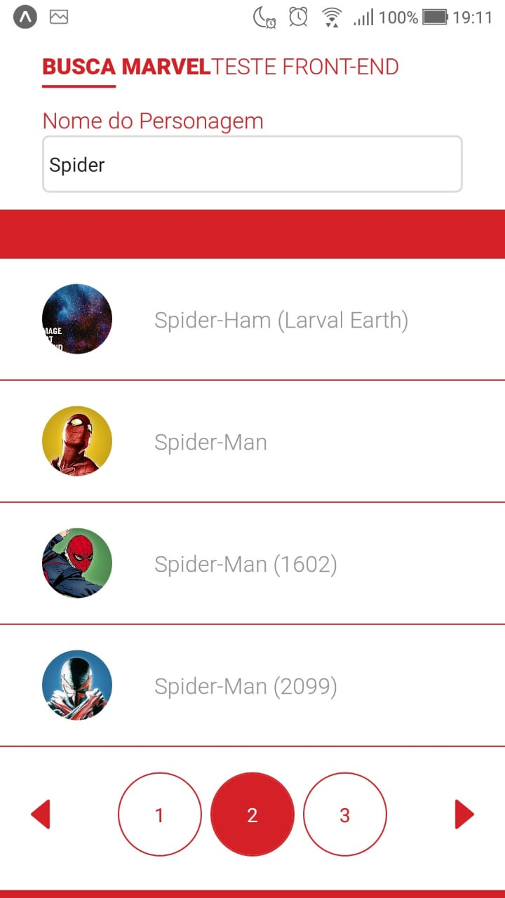
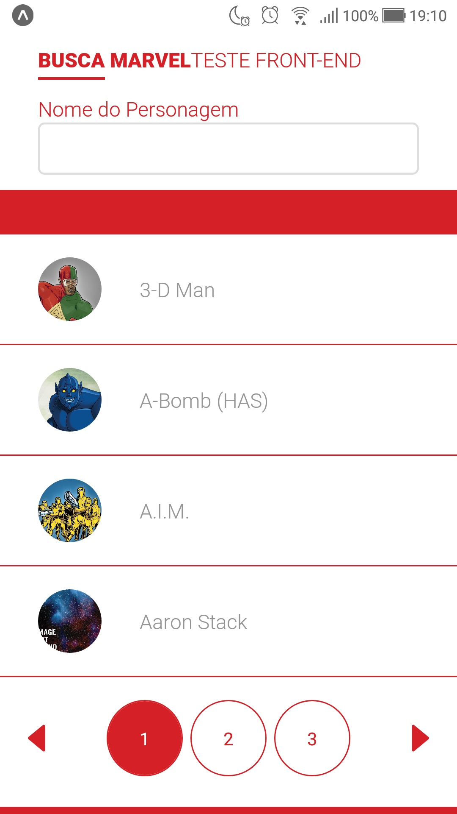
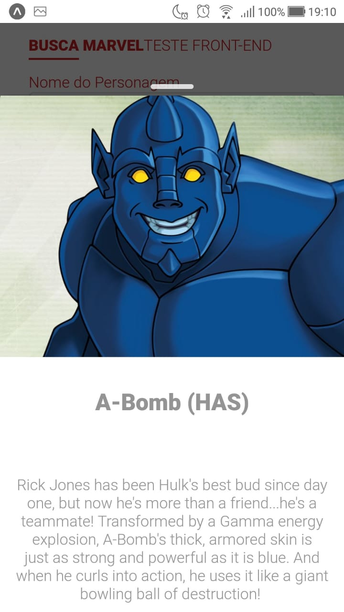

<h3 align="center">
  Code Hero, Mobile
</h3>

<blockquote align="center">“Mude você e todo o resto mudará naturalmente”!</blockquote>

  <a href="#-tecnologias">Tecnologias</a>&nbsp;&nbsp;&nbsp;|&nbsp;&nbsp;&nbsp;
  <a href="#-projeto">Projeto</a>&nbsp;&nbsp;&nbsp;|&nbsp;&nbsp;&nbsp;
  <a href="#-instalação-e-execução">Instalação e execução</a>&nbsp;&nbsp;&nbsp;|&nbsp;&nbsp;&nbsp;
  <a href="#-licença">Licença</a>

 

<h1 align="center">
  

    
    
    
  

</h1>

## 🚀 Tecnologias

Esse projeto foi desenvolvido com as seguintes tecnologias:

- [React Native](https://reactnative.dev/)
- [Expo](https://expo.io/)

## 💻 Projeto

Code Hero é uma aplicação criada em React Native + Expo, com o intuito de listar os super heróis através da Api https://developer.marvel.com/ e exibir algumas informações, bem como nome, imagem e suas características. Requisitos obrigatórios seguir o layout proposto e utilizar paginação. Além de possibilitar a busca por um super herói específico.

## 📥 Instalação e execução

Faça um clone desse repositório

### Mobile

1. A partir da raiz do projeto, entre na pasta rodando `cd mobile`;
2. Execulte `npm install` ou `yarn` para instalar as dependências;
3. Execute `expo start` para emular o projeto.

## 👨‍💻 Desenvolvido

Armando Arlan Joergensen 

## 📝 Licença

Esse projeto está sob a licença MIT. Veja o arquivo [LICENSE](LICENSE.md) para mais detalhes.
